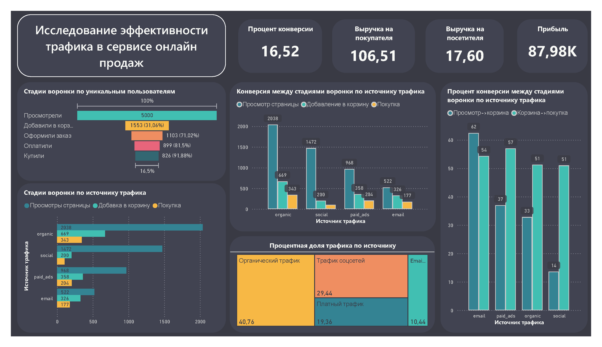

# Воронка онлайн продаж и исследование трафика

## Описание проекта

Проект посвящен анализу воронки и эффективности источников трафика для сервиса онлайн-продаж.

Цель проекта — оценить, как пользователи проходят путь от просмотра страницы товара до покупки, на каких этапах воронки происходит основная потеря пользователей, какие каналы привлечения дают наиболее качественный трафик и как поведение пользователей связано с итоговой выручкой.

В рамках проекта были подготовлены SQL-запросы для анализа событийных данных, рассчитаны ключевые продуктовые и revenue-метрики, а результаты визуализированы в Power BI-дашборде.

**Используемые инструменты:** PostgreSQL, SQL, Power BI.

---

## Описание датасета

Основной датасет проекта — таблица `user_events`, содержащая события пользователей на ecommerce-сайте.

Каждая строка таблицы представляет отдельное пользовательское событие: просмотр страницы товара, добавление товара в корзину, начало оформления заказа, ввод платежной информации или покупку.

### Основные поля датасета

| Поле | Описание |
|---|---|
| `event_id` | Уникальный идентификатор события |
| `user_id` | Идентификатор пользователя |
| `event_type` | Тип пользовательского события |
| `event_date` | Дата и время совершения события |
| `product_id` | Идентификатор товара |
| `amount` | Сумма покупки; заполняется для событий типа `purchase` |
| `traffic_source` | Источник трафика, из которого пришел пользователь |

### Этапы воронки продаж

В анализе используются следующие этапы пользовательского пути:

1. `page_view` — просмотр страницы товара;
2. `add_to_cart` — добавление товара в корзину;
3. `checkout_start` — начало оформления заказа;
4. `payment_info` — ввод платежной информации;
5. `purchase` — покупка.

### Подготовка данных

Для безопасной загрузки CSV-данных в PostgreSQL сначала создается таблица с текстовыми полями, после чего данные приводятся к нужным типам:

- `event_id`, `user_id`, `product_id` → integer;
- `amount` → numeric;
- `event_date` → timestamp.

Такой подход снижает риск ошибок при первичном импорте CSV и позволяет отдельно контролировать преобразование типов данных.

---

## Insight Summary

### 1. Воронка продаж

В проекте рассчитана ecommerce-воронка от просмотра товара до покупки:

`page_view → add_to_cart → checkout_start → payment_info → purchase`

Анализ показывает, сколько пользователей проходит каждый этап и где происходит основная потеря аудитории. Для оценки воронки использовались не только общие количества событий, но и количество уникальных пользователей на каждом этапе.

Это важно, потому что один пользователь может совершить несколько одинаковых событий, и анализ по уникальным пользователям точнее отражает реальную конверсию.

### 2. Конверсия между этапами

В SQL-запросах рассчитаны conversion rate между ключевыми этапами:

- просмотр страницы → добавление в корзину;
- добавление в корзину → начало оформления заказа;
- начало оформления заказа → ввод платежной информации;
- ввод платежной информации → покупка;
- просмотр страницы → покупка.

На основании дашборда видно, что финальная часть checkout flow работает стабильно: пользователи, дошедшие до этапа оформления и оплаты, с высокой вероятностью завершают покупку.

### 3. Источники трафика

В проекте сравниваются основные traffic sources:

- `organic`;
- `email`;
- `social`;
- `paid_ads`.

Анализ разделяет два разных понятия:

- объем трафика;
- качество трафика.

Это позволяет увидеть, какие каналы приводят много пользователей, а какие лучше конвертируют пользователей в покупателей.

### 4. Эффективность каналов

По выводам дашборда, social traffic дает высокий объем посещений, но показывает более слабую конверсию в покупку. Это может указывать на то, что значительная часть аудитории из social-канала находится на ранней стадии интереса и не готова покупать сразу.

Email, наоборот, показывает более высокую конверсию. Это может означать, что пользователи из email-канала уже лучше знакомы с продуктом, брендом или предложением и находятся ближе к покупке.

### 5. Revenue Analysis

В проекте рассчитаны ключевые revenue-метрики:

- total revenue;
- total orders;
- revenue per order;
- revenue per buyer;
- revenue per visitor.

Средний чек составляет примерно **$115**, что позволяет использовать его как базовую метрику для оценки допустимой стоимости привлечения клиента.

---

## Recommendations

### 1. UX & Website Optimization

**Не менять checkout flow без необходимости.**

Конверсия на финальных этапах от `checkout_start` до `purchase` находится на высоком уровне. Это указывает на то, что технический путь оформления заказа работает стабильно и не создает заметного трения для пользователей.

**Action:** не стоит проводить радикальный редизайн checkout-страницы прямо сейчас. Есть риск ухудшить уже работающий участок воронки. Вместо этого лучше фокусироваться на верхних этапах воронки: привлечение, добавление в корзину и переход к checkout.

---

### 2. Marketing Strategy

**Снизить зависимость от social traffic как канала прямых продаж.**

Social Media приносит значимую долю трафика, около 30%, но показывает более низкую конверсию в покупку. Это может означать, что канал хорошо работает на охват и первичный интерес, но хуже подходит для прямой продажи.

**Action:** сместить бюджет social ads от целей типа `Traffic` в сторону `Retargeting` или `Lead Generation`. Вместо ожидания немедленной покупки лучше использовать social traffic для сбора аудитории, которую затем можно прогревать через другие каналы.

---

**Усилить email marketing.**

Email показывает самую высокую конверсию, около 13%+, по сравнению с примерно 6% для social traffic. Это делает email-канал более эффективным с точки зрения качества аудитории и вероятности покупки.

**Action:** добавить более активный сбор email-контактов для пользователей, пришедших из social traffic. Например, можно использовать pop-up с предложением скидки, подписки или персонального предложения. Если перевести часть social-аудитории в email-базу, вероятность последующей покупки может вырасти.

---

### 3. Financial & Revenue

**Сопоставлять стоимость привлечения клиента с AOV.**

Средняя стоимость заказа составляет примерно **$115**. Это значит, что рекламные каналы нужно оценивать не только по количеству привлеченных пользователей, но и по стоимости привлечения покупателя.

**Action:** установить предельный Customer Acquisition Cost для платных каналов. Если привлечение клиента из social ads стоит больше **$30–$40**, а сам канал конвертирует хуже остальных, такие кампании могут быть убыточными на уровне отдельных транзакций.

---

## Project Files

| Файл / папка | Описание |
|---|---|
| `data/user_events.csv` | Исходный CSV-файл с пользовательскими событиями |
| `conversion_from_csv.sql` | SQL-скрипт для загрузки CSV и преобразования типов данных |
| `query/ga` | Основной SQL-файл с анализом воронки, источников трафика, конверсии и выручки |
| `dashboard/ecommerce_dashboard.pbix` | Power BI-файл дашборда |
| `dashboard/ecommerce_dashboard.pdf` | PDF-экспорт дашборда |
| `dashboard/ecommerce_dashboard.png` | PNG-превью дашборда |

---

## Dashboard

Ниже представлено статическое превью Power BI-дашборда. Дашборд объединяет основные результаты анализа: воронку, конверсию между этапами, эффективность источников трафика и метрики.

